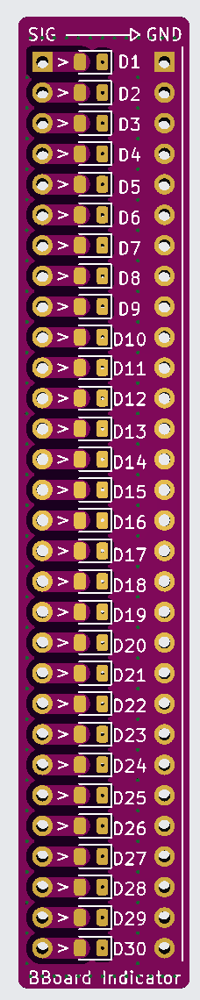
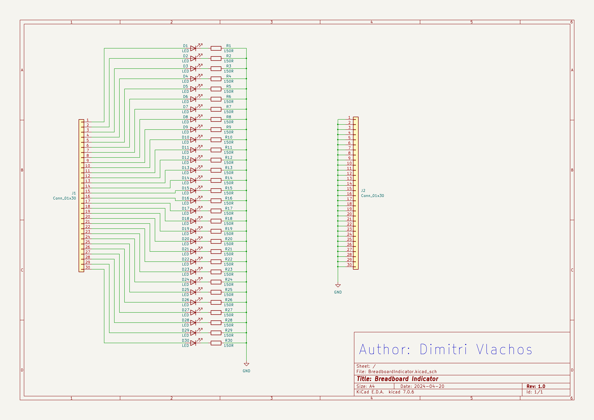

# Bread Board Indicator

This is a simple PCB design that adds a row of 30 LEDs to a breadboard in order to easily view microcontroller outputs (Or any outputs really).

## PCB
<table>
  <tr>
    <td></td><td></td>
  </tr>
 </table>
